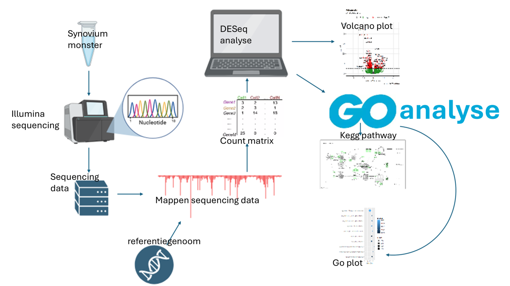
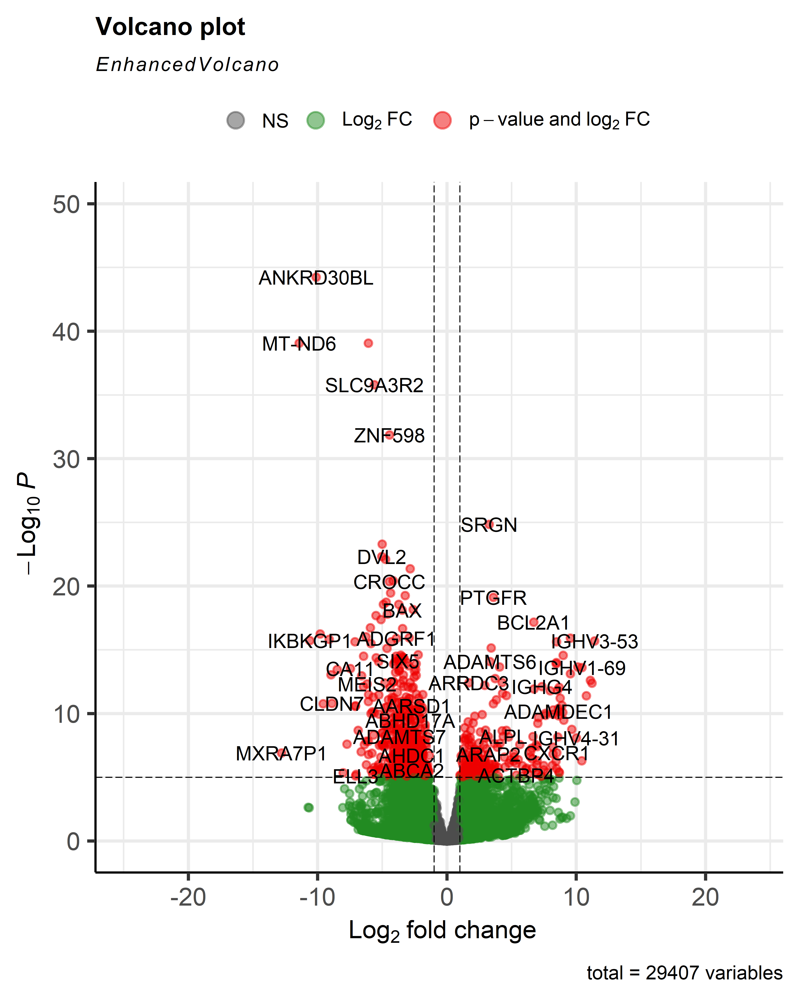
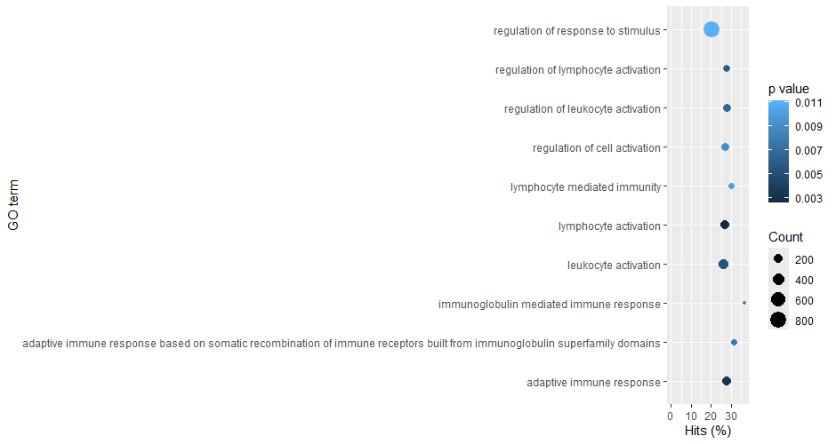
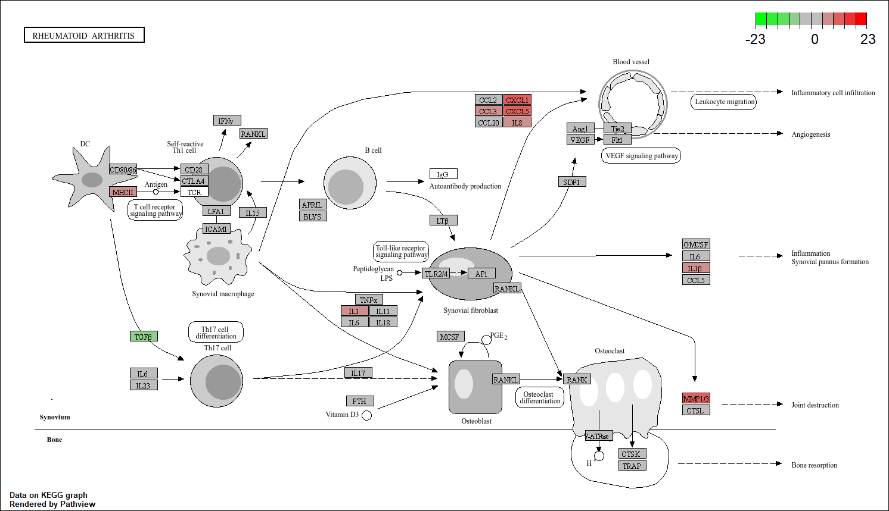

# Transcriptomics-analyse van Reumatoïde Artritis: Inzichten in differentiële genexpressie en biomarkers

## 📁 Inhoud en Structuur

- `Data/Raw` -Bevat de ruwe RNA-sequencing data (FASTQ/ZIP).
- `Data/Processed` -Verwerkte datasets en count-matrices.
- `Data/Stewardship` -Documentatie over databeheer en reproduceerbaarheid.
- `Scripts` -R-scripts voor uitlijning, statistische analyse en visualisatie.
- `Resultaten` -Grafieken (Volcanoplots, GO-plots) en KEGG-pathways.

## 🧠 Inleiding

Reumatoïde artritis (RA) is een chronische, complexe en systemische auto-immuunziekte die wereldwijd tussen de 0,5% en 1% van de bevolking treft. De aandoening wordt gekenmerkt door aanhoudende gewrichtsontsteking die, indien onbehandeld, leidt tot onomkeerbare schade aan bot en kraakbeen. Hoewel de exacte oorzaak nog niet volledig is opgehelderd, wordt aangenomen dat RA een multifactoriële etiologie heeft waarbij genetische predispositie, omgevingsfactoren en epigenetische modificaties een rol spelen (Radu & Bungau, 2021). Mensen met RA hebben bovendien een significant verhoogd risico op mortaliteit door comorbiditeiten zoals hart- en vaatziekten en infecties.

Recente ontwikkelingen in next-generation sequencing maken het mogelijk om een globaal beeld te krijgen van het transcriptoom in aangedaan weefsel, wat essentieel is voor het begrijpen van de ziektemechanismen. Dit onderzoek is gericht op het onderzoeken van genexpressieprofielen in synoviaal weefsel om aanzienlijke verschillen tussen gezonde mensen en patiënten met reumatoïde artritis te identificeren. Het streven is om bepaalde biomarkers en verstoorde signaleringsroutes te herkennen, wat kan helpen bij het stellen van een eerdere diagnose en het ontwikkelen van op maat gemaakte behandelmethoden.

Gebruikte bronnen in deze inleiding:

Gabriel, S. E. (2001). The epidemiology of rheumatoid arthritis. Rheumatic Disease Clinics of North America, 27(2), 269–281.

Platzer, A., Nussbaumer, T., Karonitsch, T., Smolen, J. S., & Aletaha, D. (2019). Analysis of gene expression in rheumatoid arthritis and related conditions offers insights into sex-bias, gene biotypes and co-expression patterns. PLoS ONE, 14(7), e0219698.

Radu, A.-F., & Bungau, S. G. (2021). Management of Rheumatoid Arthritis: An Overview. Cells, 10(11), 2857.

## 🔬 Methode

Om dit onderzoek uit te voeren is er RNA-sequencingdata van synoviumbiopten gebruikt afkomstig van een onderzoek van Platzer, Nussbaumer, Karonitsch, Smolen & Aletaha (2019). De data bestaat uit vier gezonde controles en vier patiënten met rheumatoïde artritis. Deze is vervolgens geanalyseerd met behulp van verschillende Bioconductorpackages in Rstudio (versie RStudio 2026.06.0+242).

Het mappen van de ruwe FASTQ-bestanden op het humane referentiegenoom GRCh38 (GCF_000001405.40) is de eerst uitgevoerde stap. Dit is gedaan met behulp van het Rsubrad package (versie 2.24.0). Hierna is met de `featureCounts` functie bepaald hoeveel sequencingreads aan elk gen kunnen worden gekoppeld. Met deze informatie is achtereenvolgend een countmatrix opgesteld. [Lijn 10 tot en met 54 van het script](scripts/casus_transcriptomics.R#L10-L54)

Na dit gedaan te hebben is er met het DESeq2 package (versie 1.50.2) een differentiële genexpressieanalyse uitgevoerd tussen de twee groepen (controle en RA). De genen waarvan de adjusted p-waarde < 0,05 zijn worden als significant beschouwd. Deze resultaten zijn weergegeven in een volcanoplot. [Lijn 56 tot en met 106 van het script](scripts/casus_transcriptomics.R#L56-L106)

tot slot zijn er nog een Gene Ontology (GO) en KEGG-patwayanalyse uitgevoerd met gebruik van packages goseq (versie 1.62.0), pathview (versie 1.50.0), geneLenDataBase (versie 1.46.0) en tidyverse (versie 2.0.0) om de immuun-gerelateerde pathways en biologische processen verder te onderzoeken. Waarna deze zijn uitgezet in een dotplot met GOplot (versie 1.0.2). [Lijn 108 tot en met 154 van het script](scripts/casus_transcriptomics.R#L108-L154)

  
  
  <em>Figuur 1: Flowchart van de methode</em>

## 📊 Resultaten

Nadat de differentiële genexpressieanalyse uitgevoerd was met behulp van het DESeq2 package zijn er een significant aantal genen die verschillend tot expressie komen tussen de controle- en rheumatoïde artritis-groep gevonden. Deze genen waren zowel upregulated als downregulated waargenomen. In de volcanoplot (figuur 2) vallen genen als SRGN, BCL2A1 en PTGFR op door hun sterke upregulatie bij RA-patiënten.

  
  
  <em>Figuur 2: Volcano plot van genen die differentieel tot expressie komen tussen gezonde controles en patiënten met rheumatoïde artritis</em>

Uit de GO (Geno ontology) analyse is gebleken dat meerdere van de immuun-gerelateerde biologische processen verijkt waren in de RA-groep (figuur 3). Er is in de GO-dotplot te zien dat de GO-cathegorieën die betrokken zijn bij immuunresponsen en immunoglobuline-gerelateerde processes sterk waren verrijkt. Dit kan betekenen dat antilichaam-gerelateerde processen en B-celactivatie een rol spelen bij rheumatoïde artritis.

  
  
  <em>Figuur 3: GO-dotplot van 10 van de meest verrijkte Geno Ontology cathegorieën </em>

Ook is er een KEGG-pathwayanalyse uitgevoerd. Hierbij is de T-cell receptor pathway onderzocht met gebruik van het Pathview package in R (figuur 4). In deze pathway zijn meerdere genen positief tot expressie gebracht. Hieronder vallen onder andere de genen MHCII, IL1, MMP1/3, IL1β, CCL3, en CXCL1. Dit laat lijken dat er een verhoogde activiteit is van de T-cell receptor pathway bij patiënten van rheumatoïde artritis. De pathway ondersteunt hiermee de resultaten van de overige analyses die zijn uitgevoerd.

  
  
  <em>Figuur 4: Visualisatie van de B cell receptor signaling pathway (hsa05323) </em>

## ⚡ Conclusie

Dit onderzoek bevestigt dat transcriptomics een krachtig instrument is om de moleculaire complexiteit van Reumatoïde Artritis te ontrafelen. De identificatie van genen zoals IL6, MMP13 en de potentiële biomarker PTGDS biedt belangrijke aanknopingspunten voor het monitoren van ziekteactiviteit en het remmen van progressieve gewrichtsschade. De bevindingen onderstrepen dat RA niet slechts één enkele oorzaak heeft, maar het resultaat is van een verstoord netwerk van immuun- en ontstekingsroutes.

Aanbevelingen:Voor vervolgonderzoek wordt aanbevolen om grotere en meer diverse patiëntengroepen te gebruiken, waarbij expliciet onderscheid wordt gemaakt naar geslacht en leeftijd om de geobserveerde sekse-bias verder te valideren. Daarnaast is het essentieel om meerdere metabole pathways te analyseren om een vollediger beeld te krijgen van zowel op- als ondergereguleerde genen in verschillende stadia van de ziekte. Een persoonlijke benadering, gebaseerd op deze genetische profielen, kan de effectiviteit van behandelingen zoals JAK-remmers of biologische DMARDs aanzienlijk verbeteren.
